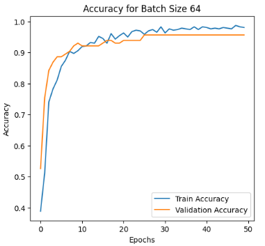
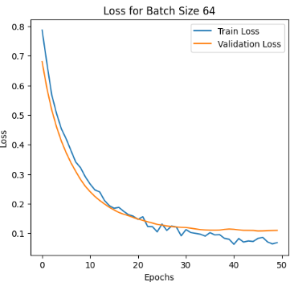

# 🧠 Breast Cancer Classification using Neural Networks

A deep learning solution for classifying breast tumors as **benign** or **malignant** based on diagnostic features.
This model is built with **TensorFlow/Keras** and trained on a structured dataset of breast tissue measurements.


## 📌 Overview

This project aims to support early breast cancer diagnosis through automated classification.
It uses a **feedforward neural network** trained on labeled clinical data and includes strategies to deal with class imbalance and improve generalization.


## 🧰 Features

- ✅ Built using **TensorFlow/Keras**
- ✅ Handles **class imbalance** using computed class weights
- ✅ Includes **feature scaling** and **label encoding**
- ✅ Trains and compares models across multiple **batch sizes**: `16`, `32`, `64`
- ✅ Saves each trained model as `.h5` files
- ✅ Plots **training accuracy** and **loss curves**


## 📊 Dataset

* Input: CSV file (`breast_cancer.csv`)
* Features: Numerical clinical features
* Target: `label` column

  * `0 = Benign`
  * `1 = Malignant`


## 🧬 Model Architecture

```
Input Layer → Dense(32, ReLU) → Dropout(0.3)
           → Dense(16, ReLU) → Dropout(0.2)
           → Output: Dense(1, Sigmoid)
```


## 📈 Training & Evaluation

During training, the model tracks both accuracy and loss, and saves visualizations like:

### 🟦 Accuracy Curve



### 🟥 Loss Curve




## 💾 Output

* Trained models saved in `.h5` format
* Performance evaluation with accuracy and loss metrics


## 👨‍💻 Technologies Used

* Python 🐍
* TensorFlow / Keras 🧠
* NumPy 📐
* Pandas 🐼
* Scikit-learn 📊
* Matplotlib / Seaborn 📈
